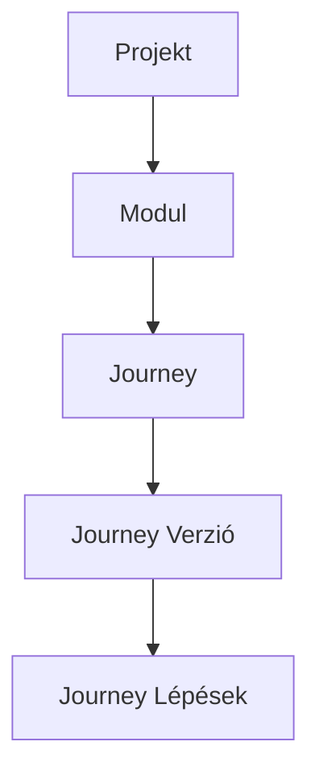

A projekt a legfelső szintű tároló az Analyse-ban. Minden — modulok, journey-k és verziózott tesztlépések — egy projekten belül helyezkedik el. A munka projektenként való elkülönítése lehetővé teszi, hogy különböző csapatok vagy termékek osztozzon egyazon Analyse-példányon anélkül, hogy zavarják egymást.

## Projekt létrehozása

<Steps>
  <Step title="A projektlista megnyitása">
    Navigálj a **Projektek** menüpontra a fő oldalsávban, és kattints az **Új projekt** gombra.
  </Step>
  <Step title="A projekt adatainak kitöltése">
    Adj meg egy **Nevet**, egy opcionális **Leírást**, és tekintsd át az automatikusan generált **Kulcsot**. A kulcsot a mentés előtt testreszabhatod, de nem tartalmazhat szóközöket — az Analyse automatikusan kisbetűs slug-gá alakítja (pl. `sajat_projekt`).
  </Step>
  <Step title="CMP azonosító hozzáadása (opcionális)">
    Ha a szervezeted Content Management Platform integrációt használ, add meg a megfelelő **CMP azonosítót** az integrációs mezőben. Ez a mező opcionális és üresen hagyható.
  </Step>
  <Step title="Mentés">
    Kattints a **Projekt létrehozása** gombra. Az Analyse létrehozza a projektet, és a részletoldalára visz.
  </Step>
</Steps>

## Projektmezők

| Mező | Kötelező | Megjegyzések |
| --- | --- | --- |
| Név | Igen | Emberi olvasásra alkalmas felirat, amely a teljes felhasználói felületen megjelenik |
| Kulcs | Igen | Egyedi slug azonosító, automatikusan generálódik a névből; max. 100 karakter |
| Leírás | Nem | Szabad szöveges kontextus a csapattagok számára |
| CMP azonosító | Nem | Külső integrációs azonosító |

<Note>
  A projektkulcs egyszer kerül beállításra a létrehozáskor a projekt neve alapján. Ha a kulcs már foglalt, az Analyse automatikusan numerikus utótagot fűz hozzá (pl. `penztar_2`). Mentés előtt egyéni kulcsot is megadhatsz, ha a generált nem illeszkedik az elnevezési konvenciódhoz.
</Note>

## A tartalomhierarchia

Az Analyse négyszintű hierarchiában szervezi a teszttartalmat. Ennek a struktúrának a megértése a kezdés előtt segít megtervezni egy olyan elrendezést, amely tükrözi a termék architektúráját.

<CardGroup cols={2}>
  <Card title="Modulok" icon="folder-open" href="/projects/modules">
    Funkcionális területek egy projekten belül (pl. „Hitelesítés", „Pénztár"). A modulok csoportosítják a kapcsolódó journey-ket és szabályozzák a megjelenítési sorrendet.
  </Card>

  <Card title="Journey-k" icon="route" href="/projects/journeys">
    Egyéni tesztelendő felhasználói folyamatok (pl. „Bejelentkezés SSO-val"). Minden journey egy modulhoz tartozik, és opcionálisan alcsoportba sorolható.
  </Card>

  <Card title="Journey verziók" icon="code-branch" href="/projects/journey-versions">
    Egy journey tesztlépéseinek verziózott pillanatképei. Egy journey-nek több verziója is lehet — vázlat vagy közzétett — amelyek különböző iterációkat képviselnek.
  </Card>

  <Card title="Teszttervek" icon="clipboard-list" href="/test-plans/overview">
    Tesztfuttatáshoz összeállított journey verziók gyűjteményei. Egy projektnek egyszerre egy aktív tesztterve lehet.
  </Card>
</CardGroup>

## Projektek és teszttervek

Egy projekt journey-jei és verziói közvetlenül a **teszttervekbe** kerülnek be. Amikor létrehozol egy teszttervet, kiválasztod, melyik journey verziókat vegyél bele. A projekt aktív tesztterve mindig látható a projekt részletoldaláról, élő áttekintést nyújtva a tesztelési lefedettségről és a futtatás státuszáról.

<Tip>
  Tartsd a projektkulcsot rövidnek és leírónak — megjelenik a navigációs hivatkozásokban, az exportált fájlnevekben és a később konfigurált integrációkban.
</Tip>